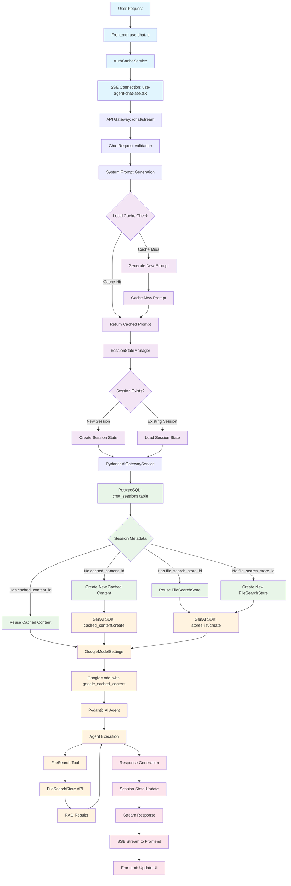

# Gemini Caching Architecture Diagram

## Complete Request Flow Through All Caching Layers



## Component Details with Parameters

### 1. User Layer Components

#### A. User Request
**Parameters:**
- `message`: string (e.g., "What are your business hours?")
- `sessionId`: string (UUID or null)
- `userType`: 'customer' | 'agent'

#### B. Frontend: use-chat.ts
**Parameters:**
```typescript
interface UseChatOptions {
  sessionId?: string;
  userType?: 'customer' | 'agent';
  enabled?: boolean;
}

interface ChatRequest {
  text: string;
  sessionId: string;
  messages: Message[];
  chatConfig: ChatConfig;
}
```

#### C. AuthCacheService
**Parameters:**
```typescript
interface AuthCache {
  userData: any;
  selectedRole: string;
  timestamp: number;
  uid: string;
}

// Cache operations
getCache(): AuthCache | null
setCache(userData: any, selectedRole: string, uid: string): void
clearCache(): void
```

#### D. SSE Connection: use-agent-chat-sse.tsx
**Parameters:**
```typescript
interface UseAgentChatSSEOptions {
  sessionId: string;
  userType: 'agent' | 'customer';
  enabled?: boolean;
  onMessage?: (message: AgentChatMessage) => void;
  onError?: (error: Event) => void;
  onConnect?: () => void;
  onDisconnect?: () => void;
}

// SSE URL construction
const sseUrl = `${API_BASE_URL}/api/v1/chat/${sessionId}/events`
```

### 2. API Gateway Components

#### E. API Gateway: /chat/stream
**Parameters:**
```python
class ChatRequest(BaseModel):
    session_id: Optional[str] = None
    message: str
    use_rag: bool = True
    custom_prompt: Optional[str] = None
    response_policy: Optional[int] = None
```

#### F. Chat Request Validation
**Parameters:**
```python
# Validated request data
validated_request = {
    'session_id': 'abc123-def456',
    'message': 'What are your business hours?',
    'use_rag': True,
    'custom_prompt': None,
    'response_policy': 50
}
```

### 3. Local Memory Cache Layer

#### G. System Prompt Generation
**Parameters:**
```python
prompt_components = {
    'file_context': List[FileContext],
    'custom_prompt': Optional[str],
    'response_policy': Optional[int],
    'rag_had_results': bool,
    'model_name': str
}
```

#### H. Local Cache Check
**Parameters:**
```python
def generate_cache_key(prompt_components: Dict[str, Any]) -> str:
    cache_data = {
        'file_context': str(sorted(safe_file_context)),
        'custom_prompt': prompt_components.get('custom_prompt', ''),
        'response_policy': prompt_components.get('response_policy', ''),
        'rag_had_results': prompt_components.get('rag_had_results', True),
        'model_name': MODEL_NAME
    }
    return hashlib.sha256(json.dumps(cache_data, sort_keys=True).encode()).hexdigest()

# Cache entry structure
context_cache[cache_key] = {
    'prompt': str,
    'timestamp': float,
    'components': Dict[str, Any]
}
```

#### I. Return Cached Prompt
**Parameters:**
```python
cached_data = {
    'prompt': 'You are an advanced intelligent knowledge assistant...',
    'timestamp': 1706234567.89,
    'components': {
        'file_context': [],
        'custom_prompt': '',
        'response_policy': 50,
        'rag_had_results': True,
        'model_name': 'gemini-2.5-flash-lite'
    }
}
```

#### J. Generate New Prompt
**Parameters:**
```python
def get_system_prompt(
    file_context: List[FileContext],
    custom_prompt: Optional[str],
    response_policy: Optional[int],
    rag_had_results: bool
) -> str:
    # Returns ~2500-word system prompt
```

#### K. Cache New Prompt
**Parameters:**
```python
cache_entry = {
    'prompt': system_prompt,
    'timestamp': time.time(),
    'components': prompt_components
}
context_cache[cache_key] = cache_entry
```

### 4. Session Management Layer

#### L. SessionStateManager
**Parameters:**
```python
class SessionStateManager:
    def get_session_state(self, session_id: str) -> Dict[str, Any]:
        return {
            'session_id': str,
            'turn_count': int,
            'message_history': List[ModelMessage],
            'last_activity': float,
            'created_at': float
        }
    
    def update_session_state(self, session_id: str, result: Any) -> Dict[str, Any]:
        # Updates turn_count and message_history
```

#### M. Session Exists Check
**Parameters:**
```python
session_state = {
    'session_id': 'abc123-def456',
    'turn_count': 0,
    'message_history': [],
    'last_activity': 1706234567.89,
    'created_at': 1706234567.89
}
```

#### N. Create Session State
**Parameters:**
```python
new_session = {
    'session_id': session_id,
    'turn_count': 0,
    'message_history': [],
    'last_activity': time.time(),
    'created_at': time.time()
}
```

#### O. Load Session State
**Parameters:**
```python
existing_session = {
    'session_id': 'abc123-def456',
    'turn_count': 2,
    'message_history': [
        ModelMessage(user_msg1),
        ModelMessage(bot_msg1),
        ModelMessage(user_msg2),
        ModelMessage(bot_msg2)
    ],
    'last_activity': 1706234589.12,
    'created_at': 1706234567.89
}
```

### 5. Database Layer

#### Q. PostgreSQL: chat_sessions table
**Parameters:**
```sql
CREATE TABLE chat_sessions (
    session_id VARCHAR(255) PRIMARY KEY,
    file_search_store_id VARCHAR(255),
    cached_content_id VARCHAR(255),
    created_at TIMESTAMP,
    updated_at TIMESTAMP
);
```

#### R. Session Metadata Query
**Parameters:**
```python
session_data = await db.fetchrow("""
    SELECT file_search_store_id, cached_content_id, created_at, updated_at
    FROM chat_sessions 
    WHERE session_id = $1
    ORDER BY created_at DESC
    LIMIT 1
""", session_id)
```

#### S. Reuse Cached Content
**Parameters:**
```python
existing_cached_content = {
    'cached_content_id': 'cached_content_abc123def456',
    'model': 'gemini-2.5-flash-lite',
    'ttl': 3600,
    'created_at': '2025-01-26T10:15:30.123456'
}
```

#### T. Create New Cached Content
**Parameters:**
```python
cached_content = genai_client.cached_content.create(
    model=MODEL_NAME,  # 'gemini-2.5-flash-lite'
    contents=system_prompt,  # ~2500 characters
    ttl=3600  # 1 hour in seconds
)

# Returns: cached_content.name (e.g., 'cached_content_xyz789abc123')
```

#### U. Reuse FileSearchStore
**Parameters:**
```python
existing_store = {
    'name': 'stores/xyz789abc123',
    'display_name': 'KnowledgeBot FileSearch Store',
    'description': 'Centralized file search store for KnowledgeBot RAG operations'
}
```

#### V. Create New FileSearchStore
**Parameters:**
```python
new_store = genai_client.stores.create(
    display_name="KnowledgeBot FileSearch Store",
    description="Centralized file search store for KnowledgeBot RAG operations"
)

# Returns: new_store.name (e.g., 'stores/def456ghi789')
```

### 6. Gemini SDK Layer

#### W. GoogleModelSettings
**Parameters:**
```python
model_settings = GoogleModelSettings(
    google_cached_content=cached_content_id,  # 'cached_content_abc123def456'
)
```

#### X. GenAI SDK: cached_content.create
**Parameters:**
```python
cached_content = genai_client.cached_content.create(
    model='gemini-2.5-flash-lite',
    contents='You are an advanced intelligent knowledge assistant...',
    ttl=3600
)

# Response structure
CachedContentResponse = {
    'name': 'cached_content_abc123def456',
    'model': 'gemini-2.5-flash-lite',
    'ttl': 3600,
    'created_at': datetime
}
```

#### Y. GenAI SDK: stores.list/create
**Parameters:**
```python
# List stores
stores = list(genai_client.stores.list())

# Create store
new_store = genai_client.stores.create(
    display_name="KnowledgeBot FileSearch Store",
    description="Centralized file search store for KnowledgeBot RAG operations"
)

# Store structure
FileSearchStore = {
    'name': 'stores/xyz789abc123',
    'display_name': 'KnowledgeBot FileSearch Store',
    'description': 'Centralized file search store for KnowledgeBot RAG operations'
}
```

### 7. Pydantic AI Layer

#### Z. GoogleModel with google_cached_content
**Parameters:**
```python
google_model = GoogleModel(
    MODEL_NAME,  # 'gemini-2.5-flash-lite'
    settings=GoogleModelSettings(
        google_cached_content=cached_content_id
    )
)
```

#### AA. Pydantic AI Agent
**Parameters:**
```python
agent = Agent(
    google_model,
    system_prompt=system_prompt,
    tools=[FileSearchTool],
    deps_type=ChatSessionDeps
)
```

#### BB. Agent Execution
**Parameters:**
```python
result = await agent.run(
    message="What are your business hours?",
    message_history=session_state['message_history'],
    deps=ChatSessionDeps(session_id=session_id)
)

# Result structure
AgentResult = {
    'data': str,
    'all_messages': List[ModelMessage],
    'usage': TokenUsage
}
```

### 8. Tools Layer

#### CC. FileSearch Tool
**Parameters:**
```python
class FileSearchTool:
    def __init__(self, file_search_store_id: str):
        self.file_search_store_id = file_search_store_id
    
    async def search(self, query: str) -> List[SearchResult]:
        # Uses FileSearchStore API
```

#### DD. FileSearchStore API
**Parameters:**
```python
search_results = genai_client.files.search(
    store=file_search_store_id,
    query="business hours"
)

# Response structure
SearchResults = {
    'results': List[FileSearchResult],
    'total_count': int
}
```

#### EE. RAG Results
**Parameters:**
```python
rag_results = [
    {
        'file_name': 'business_info.pdf',
        'content': 'Our business hours are Monday-Friday 9AM-6PM...',
        'relevance_score': 0.95,
        'page_number': 1
    }
]
```

### 9. Response Layer

#### FF. Response Generation
**Parameters:**
```python
response_text = "Based on the knowledge base, our business hours are Monday-Friday 9AM-6PM and weekends 10AM-4PM."
sources = rag_results
```

#### GG. Session State Update
**Parameters:**
```python
updated_session = {
    'session_id': 'abc123-def456',
    'turn_count': 1,
    'message_history': [
        ModelMessage(user_msg),
        ModelMessage(bot_msg)
    ],
    'last_activity': time.time(),
    'created_at': original_created_at
}
```

#### HH. Stream Response
**Parameters:**
```python
async def stream_response(response_text: str, session_id: str):
    for word in response_text.split():
        chunk = {
            "type": "content",
            "content": word + " ",
            "session_id": session_id,
            "timestamp": datetime.utcnow().isoformat()
        }
        yield f"data: {json.dumps(chunk)}\n\n"
        await asyncio.sleep(0.05)
```

#### II. SSE Stream to Frontend
**Parameters:**
```typescript
interface SSEChunk {
    type: 'content' | 'metadata' | 'error';
    content?: string;
    session_id: string;
    timestamp: string;
    message_id?: string;
}
```

#### JJ. Frontend: Update UI
**Parameters:**
```typescript
interface Message {
    id: string;
    text: string;
    sender: 'user' | 'bot' | 'agent';
    timestamp: string;
    metadata?: {
        sources?: SearchResult[];
        cached?: boolean;
        turn_number?: number;
    };
}

// UI update
setMessages(prev => [...prev, newMessage]);
```

## Cache Performance Metrics

### Local Memory Cache
- **Hit Rate Target**: >80%
- **TTL**: 3600 seconds (1 hour)
- **Memory Usage**: ~10MB for 100 cached prompts

### Gemini Cached Content
- **Cost Savings**: 90% discount
- **TTL**: 3600 seconds (1 hour)
- **Reuse**: Across all sessions with same prompt

### FileSearchStore
- **Reuse**: Across all sessions
- **Cost**: One-time creation cost
- **Performance**: Optimized RAG operations

### Session State
- **Memory**: ~1MB per active session
- **Turn Limit**: 5 turns per session
- **Implicit Prefix Caching**: Additional savings on turns 2-5

## Cost Analysis Example

### Request Flow Costs:
1. **Turn 1 (Cache Miss)**: $0.000188
2. **Turn 2-5 (Cache Hit)**: $0.0000188 each
3. **Total 5-turn session**: $0.0002632
4. **Without caching**: $0.00094
5. **Total savings**: 72% per session
